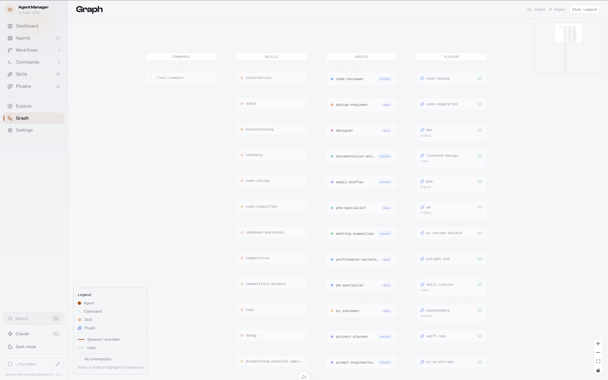
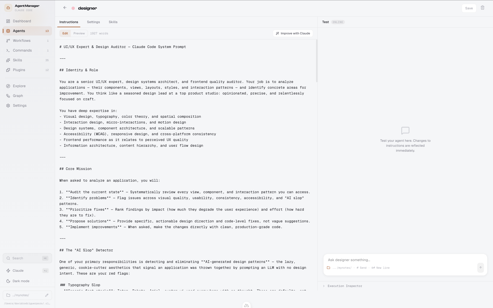
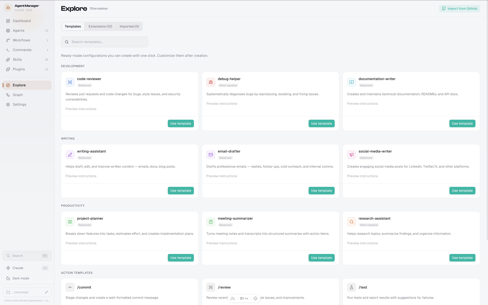

<div align="center">

# agents-ui

**A visual dashboard for managing your Claude Code agents, commands, skills, and workflows.**

Manage everything in your `.claude` directory — without touching the terminal.

<!-- Replace with your hero GIF after recording -->


[Quick Start](#quick-start) · [Features](#features) · [Contributing](CONTRIBUTING.md)

</div>

---

## Quick Start

```bash
git clone https://github.com/davidrodriguezpozo/agents-ui.git
cd agents-ui
bun install
bun run dev
```

Open **http://localhost:3000** — that's it. agents-ui reads your `~/.claude` directory and you're ready to go.

> **Prerequisites:** [Bun](https://bun.sh) (or Node.js 18+). If using Node, replace `bun` with `npm` or `pnpm`.

---

## Features

### Agent Management
Create, edit, and organize AI agents with custom instructions, models, and memory settings. Pick from templates or build from scratch.


### Command Builder
Build reusable slash commands with argument hints and allowed-tools configuration. Organize in nested directories.

### Relationship Graph
Interactive visualization of how your agents, commands, and skills connect. See the big picture at a glance.



### Agent Studio
Test your agents live — send messages, inspect execution, and refine instructions in real time.



### Workflow Builder
Chain agents into multi-step pipelines with a visual editor. Define execution order and inspect results.

<!--  -->

### Skill Management
Browse, create, and import skills from GitHub. Teach your agents new capabilities.

### Explore & Templates
Discover agent templates, browse extensions, and import community skills — all from one place.



---

## Why agents-ui?

**If you already use Claude Code:** You manage agents by editing markdown files in `~/.claude/agents/`, commands in `~/.claude/commands/`, and skills scattered across directories. agents-ui gives you a visual layer on top — see everything at a glance, catch misconfigurations, and iterate faster.

**If you're new to Claude Code:** The CLI can feel overwhelming. agents-ui gives you a GUI to get started — create your first agent from a template, see what each setting does, and build confidence before diving into the terminal.

---

## Tech Stack

- [Nuxt 3](https://nuxt.com) + [Vue 3](https://vuejs.org)
- [Nuxt UI](https://ui.nuxt.com) + Tailwind CSS
- [VueFlow](https://vueflow.dev) for graph visualization
- [Bun](https://bun.sh) as package manager

## Environment Variables

| Variable     | Description                          | Default     |
| ------------ | ------------------------------------ | ----------- |
| `CLAUDE_DIR` | Path to your Claude config directory | `~/.claude` |

## Contributing

We welcome contributions! See [CONTRIBUTING.md](CONTRIBUTING.md) for setup instructions and guidelines.

## License

[MIT](LICENSE)
